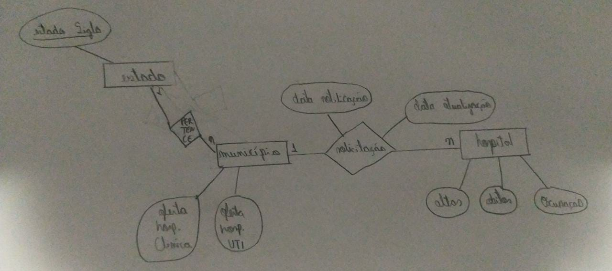

# Aluno
Mariana Alves de Sousa
## Tarefa 1 sobre APIs de acesso
[Notebook](https://colab.research.google.com/drive/1I5QplFeyIQhSNXHjPKFMtxyb2QjgYlSn?usp=sharing)
## Tarefa 2 sobre Engenharia reversa

