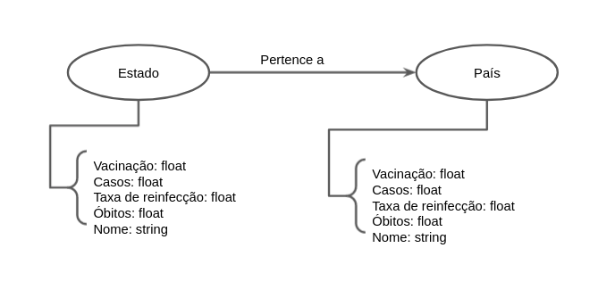

# Aluno
* `241201`: `Mariana Alves de Sousa`

## Modelo Lógico do Banco de Dados de Grafos
> 

## Perguntas de Pesquisa/Análise

> Liste aqui as três perguntas de pesquisa/análise
> * Proporcionalmente, estados com maior número de óbitos tiveram maior busca por vacinação?
> * Proporcionalmente, a taxa de reinfecção é menor para estados que tem mais pessoas vacinadas?
> * Proporcionalmente, a taxa de casos é menor para estados que tem mais pessoas vacinadas?
