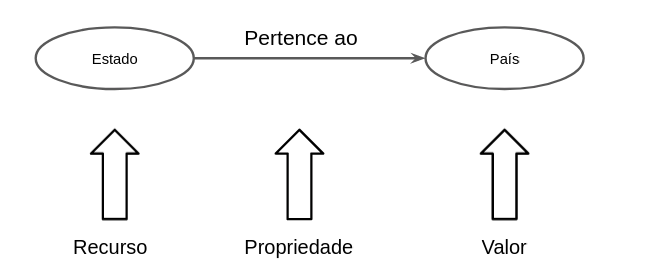

# Aluno
* `241201`: `Mariana Alves de Sousa`

## Exemplo de modelo de grafo
> 

## Perguntas de Pesquisa/Análise

> Liste aqui as três perguntas de pesquisa/análise
> * Qual foi o estado com mais mortes por covid?
> * Qual foi o estado com maior taxa de vacinação?
> * O estado com maior taxa de reinfecção foi o mesmo que teve a maior vacinação?
